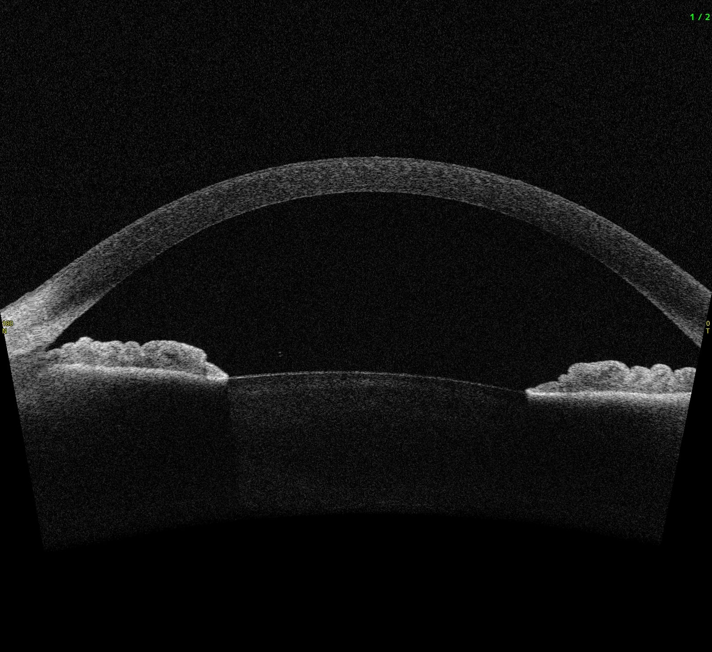
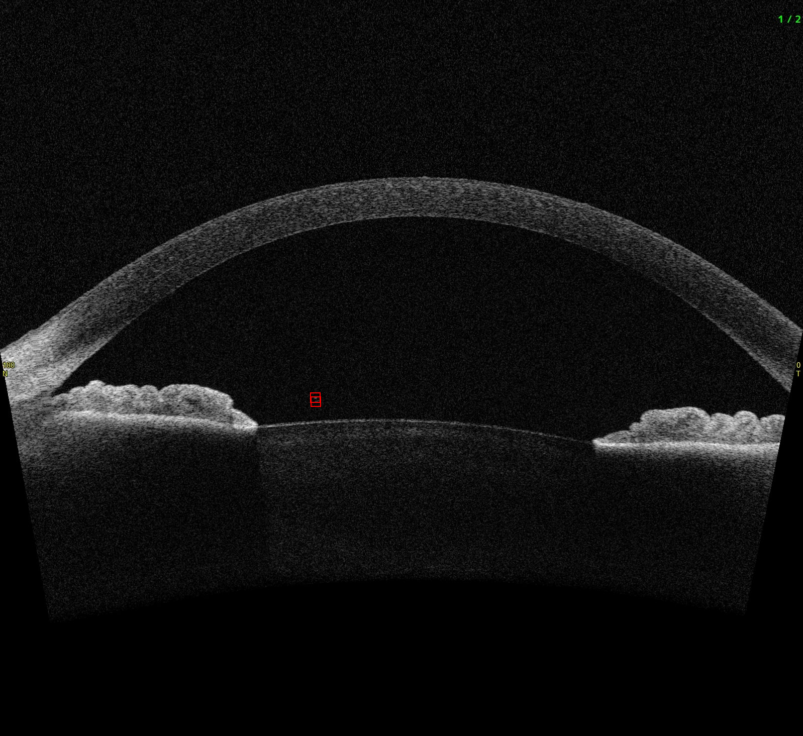

# Anterior Chamber Cell Detector (ACCDor)
This repository contains the code for ACCDor, an anterior chamber cell detector.

## Installation
1. Create a new conda environment with Python 3.9:
```
conda create -n accdor python=3.9
```
2. Activate the conda environment:
```
conda activate accdor # sometimes could be `source activate accdor`
```
3. Install the required dependencies:
```
pip install -r requirements.txt
```
## Checkpoints
ACCDor requires a pre-trained ViT model. Download the model from the [ViT-H SAM model](https://dl.fbaipublicfiles.com/segment_anything/sam_vit_h_4b8939.pth) link.
The link is provided in the [SAM](https://github.com/facebookresearch/segment-anything?tab=readme-ov-file#model-checkpoints) repository.

## Getting Started
To process an image, segment the AC area, and detect cells, run the following command:
```
python -m apps.detect_cell
```
By default, this command will process the image located at `data/example/example1.jpeg`. The output will be saved in the `data/output/{image_name}` directory, where `{image_name}` is the name of the example image (in this case, `example1`).
## Showcase
After running `apps.detect_cell`, intermediate stage images will also be generated. Below are examples of the generated images for the sample input image.
### Original image

### Anterior Chamber Mask

### Cell Mask (Processed by Adjusted Cutoff)

### Cell Mask (Discard the False Positive Candidate Cells)

### Cell Dection by ACCDor



## Citation

arXiv: https://arxiv.org/abs/2406.17577

To cite ACCDor in publications, please use:

```bibtex
@article{chen2024,
      title={Advancing Cell Detection in Anterior Segment Optical Coherence Tomography Images}, 
      author={Boyu Chen and Ameenat L. Solebo and Paul Taylor},
      year={2024},
      journal={arXiv preprint arXiv:2406.17577}
}

```